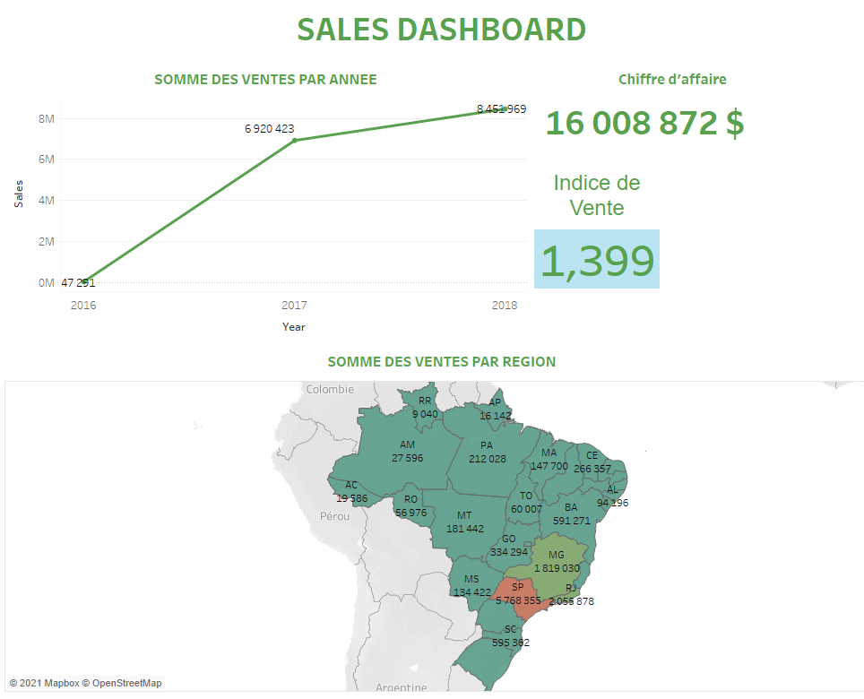
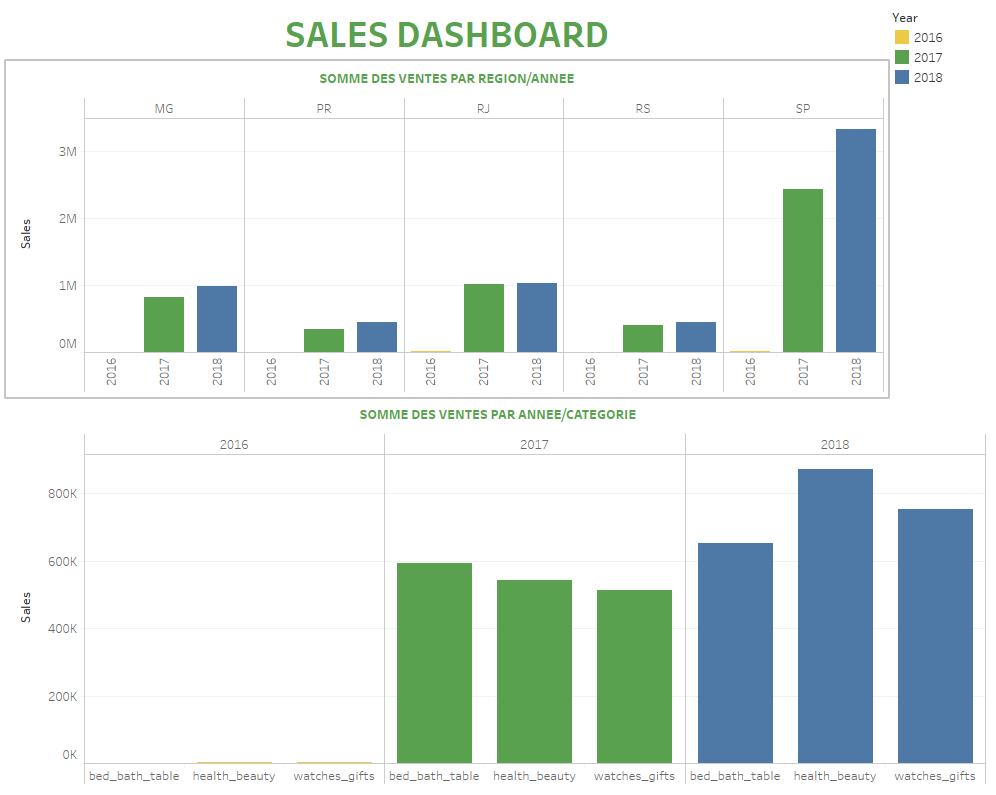
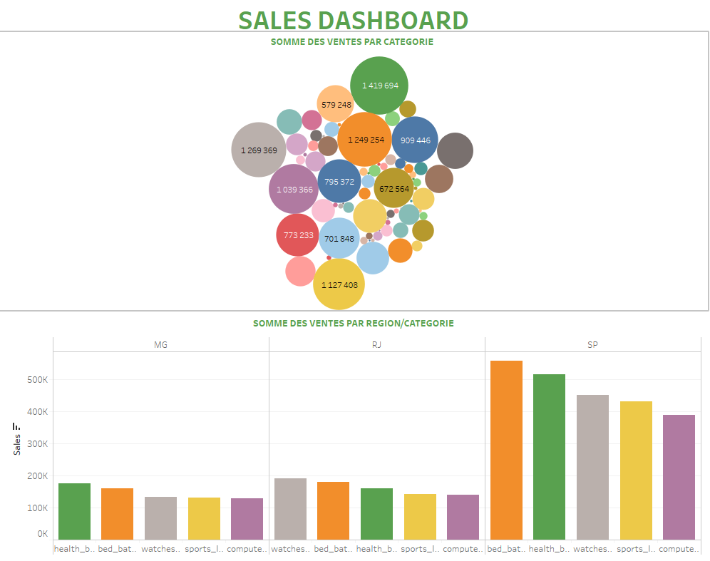
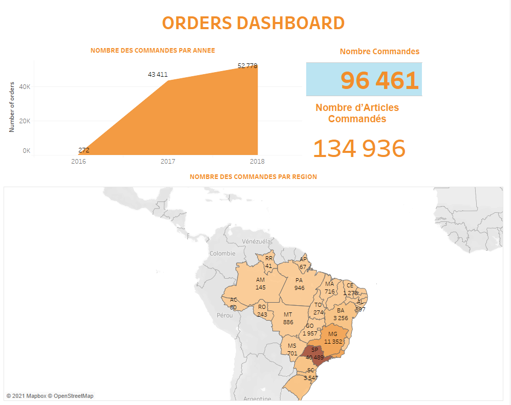
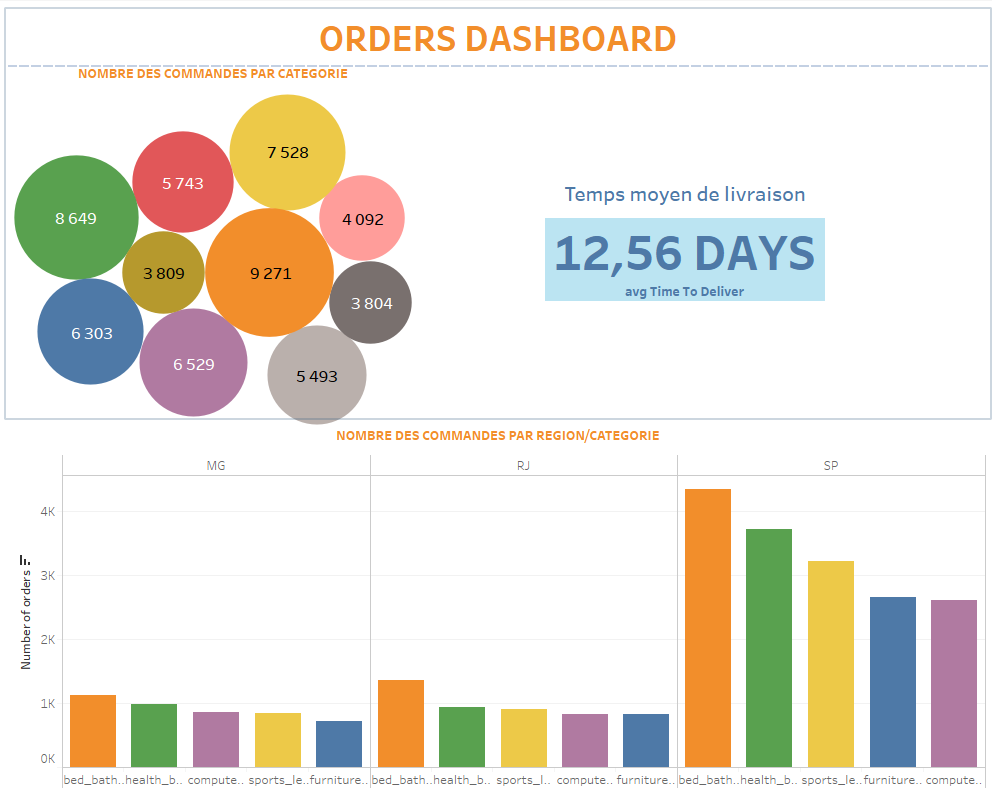
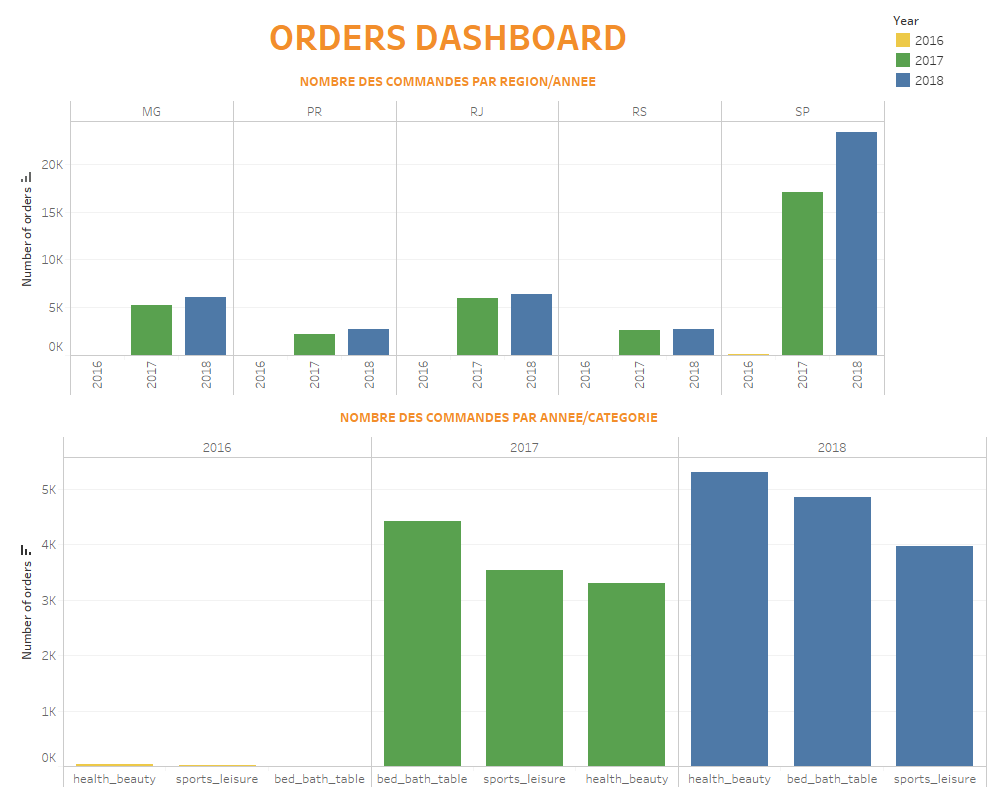
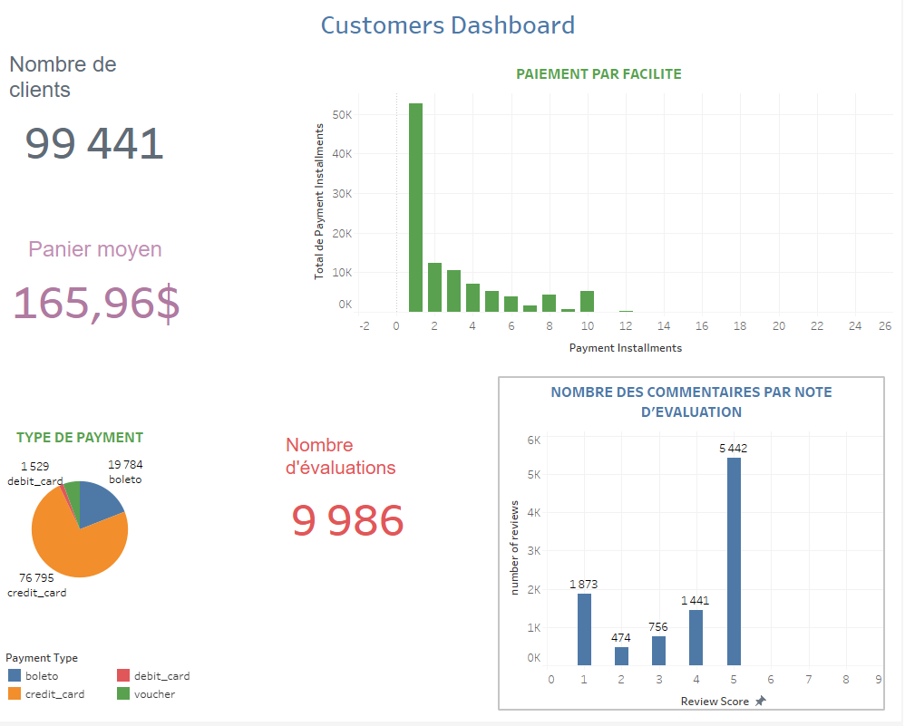
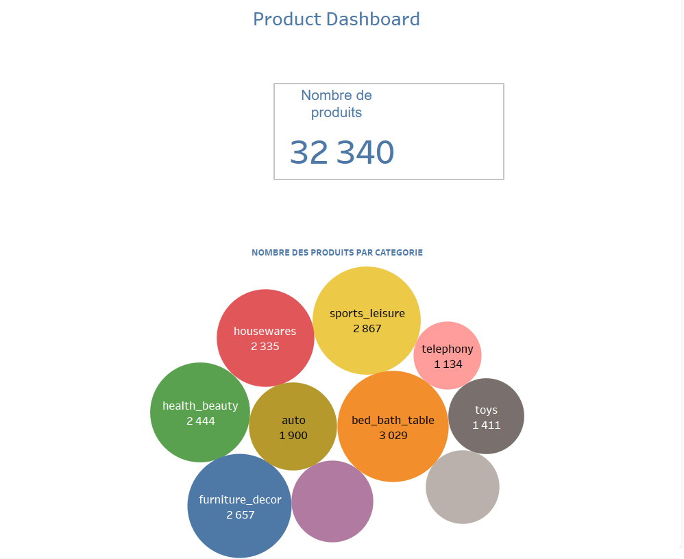

# Data-Visualisation-Ecommerce

## Introduction
Le E-commerce a pris une tournure extraordinaire durant la dernière décennie, il s’est démocratisé dans le monde entier, c’est pour cela que nous avons choisi une dataset E-Commerce d’un magasin au brésil afin de visualiser les données et tirer des remarques et des conclusion. On a utilisé Python pour les prétraitements et Tableau pour la visualisation des KPIs dans différents dashboards.

## Description Dataset
On a choisi d’utiliser la dataset Brazilian E-Commerce Public Dataset by Olist qui est disponible sur Kaggle, après anonymisation cette dataset est maintenant public regroupant les ventes et les produits de différentes catégories, L'ensemble de données contient des informations sur 100000 commandes de 2016 à 2018 effectuées sur plusieurs marchés au Brésil. Ses fonctionnalités permettent de visualiser une commande à partir de plusieurs dimensions: du statut de la commande, du prix, du paiement et des performances de transport à l'emplacement du client, aux attributs du produit et enfin aux avis rédigés par les clients. Il s'agit de données commerciales réelles, elles ont été anonymisées et les références aux entreprises et partenaires.

